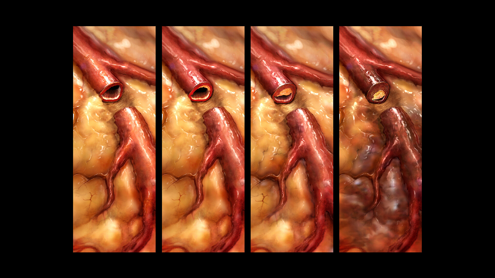

# Cardiovascular Disease Prediction with Machine Learning

This project explores a dataset containing health-related features of patients diagnosed with heart disease. The target variable, is an integer ranging from 0 (no heart disease) to 4 (highest severity), indicating the presence and level of the disease. The primary objective is to develop a machine learning model capable of predicting the level of heart disease based on the provided features.

Due to limitations in the dataset size, this project serves as a practical illustration of the machine learning and data analysis workflow for heart disease prediction.  While the model might not achieve significant generalizability, the project provides valuable insights into feature engineering, model selection, and the overall process of building predictive models for heart disease.

